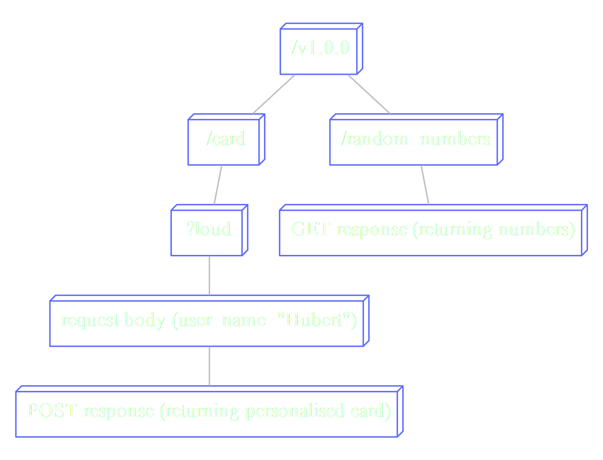
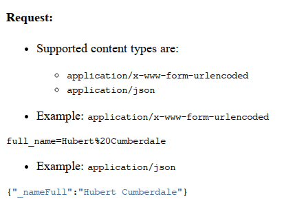
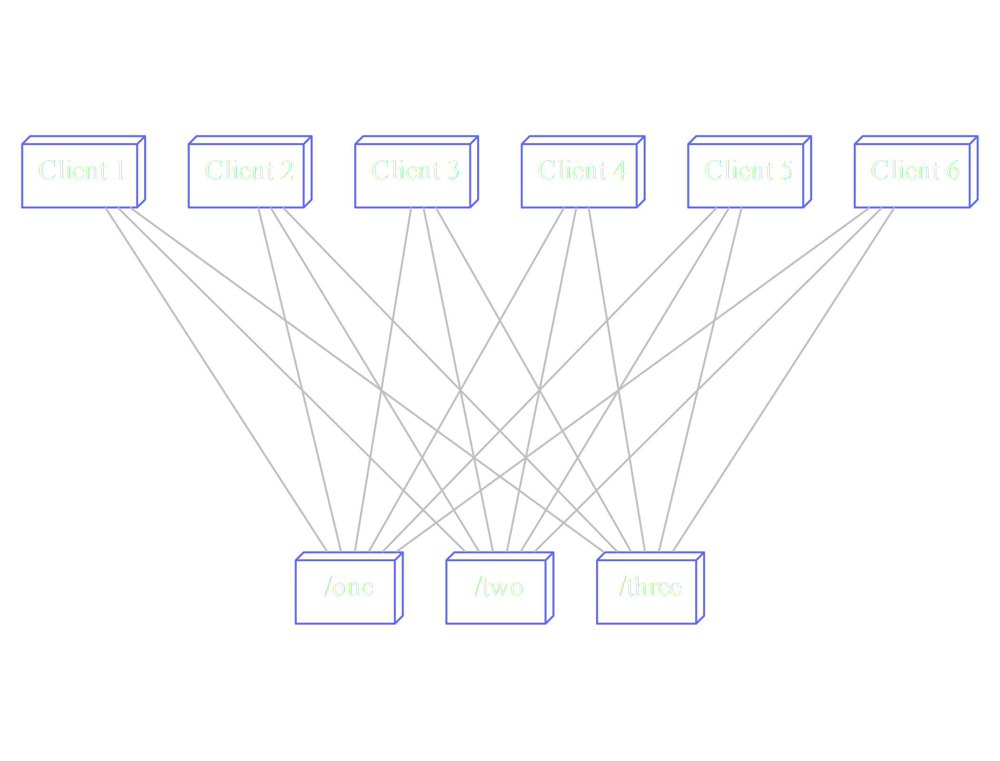

% Your Web Service as a Type
% (Typing REST APIs with Servant)

# Every time we write a REST API

Your API will...

* Explode in subtle ways
* Boilerplate gets mixed with important business logic
* Complexity becomes nightmare to maintain
* Becomes partially and/or inconsistently documented

# Servant is...

* A collection of libraries built around the concept of typed APIs.
* n devs
* n commercial users
* About to hit a 0.3 release with some major improvements.

# Your API wants types

[columns]

[column=0.5]

*REST problems*

* Explode in subtle ways
* Boilerplate gets mixed with important business logic
* Complexity becomes nightmare to maintain
* Becomes partially and/or inconsistently documented


[column=0.5]

*Types can fix that!*

* Explode in obvious ways
* Make generic programming an option
* Provide a framework for complexity
* Provide documentation, with 100% coverage

[/columns]

# How do you even?

How do we represent our API as a type?

First, let's look at it like a tree:

* Leaves are endpoints (GET, POST, etc)
* Nodes along the way to leaves "modify" that endpoint.


# APIs have shapes



# Types have shapes (type operators)

[columns]

[column=0.5]

*head :> tail*

* For joining nodes
* Constructor for a type level non-empty list
* Not directly inhabitable

[column=0.5]

*branch1 :<|> branch2*

* For branching
* Constructor for alternatives (disjunction)
* Inhabitable via :<|>

[/columns]

[columns]

[column=0.5]

```haskell
data (path :: k) :> a
    deriving (Typeable)
    infixr 9 :>
```

[column=0.5]

```haskell
data a :<|> b = a :<|> b
    deriving (Typeable, Eq, Show)
infixr 8 :<|>
```

[/columns]

# APIs have shapes


# Shape as a type!

```haskell

type MakeCard =
    "card"
    :> QueryFlag "loud"
    :> ReqBody '[FormUrlEncoded, JSON] Name
    :> Post '[JSON] PersonalisedCard

type RandomInt =
    "random_number" :> Get '[JSON] Int

type CardAPI = "v1.0.0" :> (MakeCard :<|> RandomInt)
```
# How would a typed API even work?

Before we can type the APIs, I have to explain some "fundamentals":

* DataKinds
* PolyKinds
* Data.Proxy
* GHC.TypeLits
* TypeFamilies

# DataKinds, PolyKinds, Proxy & TypeLits

```haskell
import Data.Proxy
import GHC.TypeLits

-- | A concrete, poly-kinded proxy type  
data Proxy a = Proxy

stringProxy :: Proxy "I AM A TYPE-LEVEL STRING!"
stringProxy = Proxy

listProxy :: Proxy '[Int, Bool, String]
listProxy = Proxy

symbolVal :: KnownSymbol str => Proxy str -> String
```

# TypeFamilies

* Just functions at the type level
* We will use them in the associated form (appearing in a type  class).
* These are called "associated type synonyms".
* They are a specific case of top-level "open" or "closed" type families, but
  give better errors and are clearer in their intentions.

# Silly type family example

```haskell

class Frobable a where
  type FrobingResult a -- Associated type synonym

  frob :: Proxy a -> FrobingResult a

data MeaningOfLife

instance Frobable MeaningOfLife where
  type FrobResult MeaningOfLife = Int

  frob :: Proxy MeaningOfLife -> FrobResult MeaningOfLife
  frob _ = 42
```

# Silly type family example

```haskell
data EatsBools

widget :: Proxy (EatsBools :> MeaningOfLife)
widget = Proxy

instance Frobable rem => Frobable (EatsBools :> rem) where
  type FrobResult (EatsBools :> rem) =
    Bool -> Maybe (FrobResult rem)

  frob :: Proxy (EatsBools :> rem)
       -> FrobResult (EatsBools :> rem)
  frob _ True = Just $ frob (Proxy :: Proxy rem)
  frob _ False = Nothing

```

# The results

```haskell
> :t frob
frob :: Frobable a => Proxy a -> FrobResult a

> :t widget
widget :: Proxy (EatsBools :> MeaningOfLife)

> :t frob widget
frob widget :: FrobResult (EatsBools :> MeaningOfLife)

> let x = frob widget
> :t x
```

# The results

```haskell
> :t frob
frob :: Frobable a => Proxy a -> FrobResult a

> :t widget
widget :: Proxy (EatsBools :> MeaningOfLife)

> :t frob widget
frob widget :: FrobResult (EatsBools :> MeaningOfLife)

> let x = frob widget
> :t x
x :: Bool -> Maybe Int
```

# Recap

* APIs are painful, we are currently trying to apply the type band-aids.
* The tree-like shape of your API can be expressed with types.
* Adding Type families and Proxies allow us to take an API type and manipulate
  it into another type, as we please.

# Ugly server boilerplate

Ugly server code often tries to business logic whilst...

* Parsing/printing
* Web servering
* HTTPing

# Types help us do the things better

Let's see if we can express our business logic by itself, and cram all of the
boiler plate into instances somewhere.

# HasServer, a dumping ground for boilerplate

```haskell
class HasServer layout where
  type Server layout :: *
  route :: Proxy layout
        -> Server layout
        -> RoutingApplication

instance HasServer Delete where
  type Server Delete = EitherT (Int, String) IO ()

  route Proxy action request respond
    | pathIsEmpty request
    && requestMethod request == methodDelete = do
        e <- runEitherT action
        . . .
```

# Distribute your alternatives

```haskell
instance (HasServer a, HasServer b) =>
        HasServer (a :<|> b) where

  type Server (a :<|> b) = Server a :<|> Server b

  route Proxy (a :<|> b) request respond =
    route pa a request $ \ mResponse ->
      if isMismatch mResponse
        then route pb b request $ \mResponse' ->
                respond (mResponse <> mResponse')
        else respond mResponse

    where pa = Proxy :: Proxy a
          pb = Proxy :: Proxy b
```

# Unwravelling the type one step at a time

```haskell
instance (KnownSymbol sym, FromText a, HasServer sub)
      => HasServer (QueryParam sym a :> sub) where

  type Server (QueryParam sym a :> sub) = Maybe a -> Server sub

  route Proxy subserver req respond = do
    let query = parseQueryText $ rawQueryString req
        paramname = cs $ symbolVal ps
        param = fmap fromText
              . join $ lookup paramname query
    route (Proxy :: Proxy sub)
          (subserver param)
          request respond
          . . .
```

# But how does the content-typing work?

```haskell
type MakeCard =
    "card"
    :> QueryFlag "loud"
    :> ReqBody '[FormUrlEncoded, JSON] Name
    :> Post '[JSON] PersonalisedCard

type RandomInt =
    "random_number" :> Get '[JSON] Int

type CardAPI = "v1.0.0" :> (MakeCard :<|> RandomInt)
```

# We seperate handling of content types

```haskell
instance ToFormUrlEncoded Name where
    toFormUrlEncoded (Name full) =
      [("full_name", full)]

instance FromFormUrlEncoded Name where
    fromFormUrlEncoded xs =
        Name <$> note "specify full_name" (lookup "full_name" xs)

instance FromJSON PersonalisedCard
instance ToJSON PersonalisedCard

. . . 
```

# Business logic is now isolated

```haskell
server :: Server CardAPI
server = makeCard :<|> randomNumber

makeCard :: Monad m
         => Bool -> Name -> m PersonalisedCard 
makeCard loud (Name full_name) =
    return . PersonalisedCard $
      if loud
        then "HELLO " <> toUpper full_name <> "!!1"
        else "Hello " <> full_name <> "."

randomNumber :: Monad m => m Int
randomNumber = return 4
```

# API type to documentation.

```haskell
docs :: HasDocs layout => Proxy layout -> API                                   

instance ToParam (QueryFlag "loud") where
  toParam _ =
    DocQueryParam "loud"
                  ["true", "false"]
                  "Get the personalised card loudly.\
                  \ Default is false."
                  Flag
```

# Type errors will make you define instances


```haskell
instance ToSample Int where
  toSample = Just 4 -- Fair dice roll

instance ToSample Name where
  toSample = Just $ Name "Hubert Cumberdale"

instance ToSample PersonalisedCard where
  toSamples =
    [ ("If you use ?loud",
      , PersonalisedCard "HELLO, HUBERT CUMBERDALE!!1")
    , ("If you do not use ?loud"
      , PersonalisedCard "Hello, Hubert Cumberdale.")
    ]
```

# Now you can markdown the things

```haskell
docs :: HasDocs layout => Proxy layout -> API                                   

markdown :: API -> String
```

# Converted to HTML


# Converted to HTML



# Clients for free (tackling complexity)

Consider an unversioned API that has:

* Three breaking changes
* Six users

How many changes must you make to fix all of the things?

# Clients for free (tackling complexity)



# Writing clients, the lazy way

```haskell
createCard
    :: Bool
    -> Name
    -> BaseUrl
    -> EitherT ServantError IO PersonalisedCard

getDice
    :: BaseUrl
    -> EitherT ServantError IO [Int]

(createCard :<|> getDice) = client cardApi
```

# How could such a magical unicorn exist?

```haskell
client
  :: HasClient layout => Proxy layout -> Client layout                     
```

# The magic: distribute (:<|>)

```haskell
class HasClient layout where
  type Client layout :: *
  clientWithRoute
    :: Proxy layout -> Req -> Client layout


  instance (HasClient a, HasClient b)
        => HasClient (a :<|> b) where               
    type Client (a :<|> b) = Client a :<|> Client b                               
    clientWithRoute Proxy req =                                                   
      clientWithRoute (Proxy :: Proxy a) req :<|>                                 
      clientWithRoute (Proxy :: Proxy b) req   
```

# Clients for free!

```haskell
createCard
    :: Bool
    -> Name
    -> BaseUrl
    -> EitherT ServantError IO PersonalisedCard

getDice
    :: BaseUrl
    -> EitherT ServantError IO [Int]

(createCard :<|> getDice) = client cardApi
```

# Type safe URLs

```haskell
safeLink
    :: forall endpoint api. ( IsElem endpoint api
                            , HasLink endpoint)
    => Proxy api
    -> Proxy endpoint
    -> MkLink endpoint
```

# With input!

```haskell
let nums = Proxy :: Proxy ("v1.0.0" :> RandomInts)
print $ safeLink cardApi nums 
```

. . . 

```
>> v1.0.0/random_numbers
```

. . . 

```haskell

let make_card = Proxy :: Proxy ("v1.0.0" :> MakeCard)
let f :: Bool -> URI = safeLink cardApi make_card
traverse_ print [f True, f False]
```

. . . 


```
>> v1.0.0/card?loud
>> v1.0.0/card
```

# Conclusion

* Types and webservices can be friends
* By defining your API as a type, you can get for free:
	- Server boilerplate
	- Documentation
	- Clients (Haskell, jquery, PureScript)
	- Safe links
